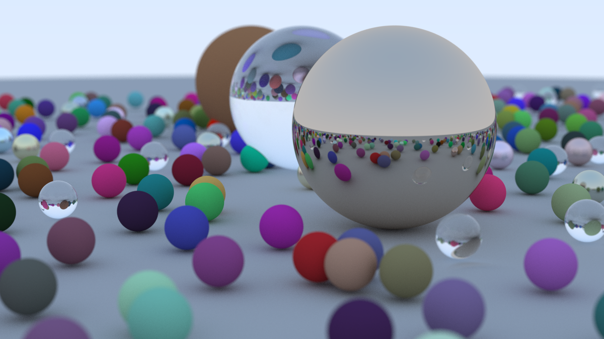

# Ray Tracing in One Weekend - Zig

A Zig implementation of the [Ray Tracing in One Weekend](https://raytracing.github.io/) book.

## Output



## Building

```bash
zig build
```

## Running

```bash
./zig-out/bin/ray_tracing_in_one_weekend_zig > image.ppm
```

## Project Structure

- `src/camera.zig` - Camera implementation
- `src/color.zig` - Color utilities
- `src/interval.zig` - Interval math
- `src/main.zig` - Main entry point
- `src/material.zig` - Material definitions
- `src/ray.zig` - Ray structure and operations
- `src/shapes.zig` - Geometric shapes
- `src/utils.zig` - Utility functions
- `src/vectors.zig` - Vector math
